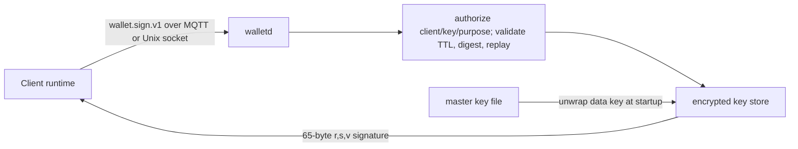

# Agent Wallet

Agent Wallet is a small, process-isolated Rust service that owns EOA private
keys and signs precomputed EIP-712 digests. Flowgent, Sigbot, and other clients
remain payment orchestrators; they never load or decrypt a private key.



## Boundary

- `walletd` owns secp256k1 key generation/import, EOA address derivation,
  encrypted storage, request validation, and recoverable digest signatures.
- The client owns business policy, x402 payload construction, EIP-712 hashing,
  and the signed resource retry. Resource servers own facilitator settlement.
- The protocol carries a 32-byte digest. It does not carry a private key or
  embed Flowgent/Sigbot domain models.
- Key administration is offline through `walletd key ...`; stop the daemon
  before mutating keys or rotating the master key.

## Storage and signing

On first open, the store creates a random 256-bit data-encryption key. A key
derived from the configured master key with HKDF-SHA-256 wraps that data key.
Each EOA private key is independently encrypted with XChaCha20-Poly1305 and
metadata-bound associated data. Master-key rotation only replaces the small,
atomic data-key envelope.

Private key material is zeroized after use where Rust ownership permits. The
crate forbids its own `unsafe` code. These controls reduce memory-corruption and
accidental disclosure risks; they do not protect a compromised host or broker.

## Build and test

```bash
make lock
make test
make e2e
make lint
make verify
make build
make image
```

`make verify` is the complete acceptance gate. Flowgent's root Makefile
intentionally has no Wallet targets.

`make image` uses overridable `BUILDER_IMAGE`, `RUNTIME_IMAGE`, and
`DOCKER_BUILD_ARGS` variables. The defaults use reachable mirrored Alpine
images and install the distribution Rust toolchain in the build stage; a Wallet
release pipeline MAY pin equivalent internal images by digest.

## Configure and run

```bash
cp config/wallet.example.toml config/wallet.toml
walletd master-key generate --output /run/secrets/wallet/master.key
walletd --config config/wallet.toml key generate payer
walletd --config config/wallet.toml serve
```

`key import` reads a 32-byte secp256k1 private key as hex from a file so the
secret is not exposed in process arguments. Secret input files MUST be regular,
owner-only files and MUST NOT be symlinks:

```bash
walletd --config config/wallet.toml key import payer \
  --private-key-file /run/secrets/wallet/payer.hex
```

Use `master-key rotate --new-key-file PATH` while the service is stopped, then
update `store.master_key_file` before restart. The old key cannot reopen the
rotated envelope.

## Wire contract

MQTT clients publish to `wallet/v1/sign/requests/{client_id}`. Wallet consumes
`$share/{group}/wallet/v1/sign/requests/+` and responds on
`wallet/v1/sign/responses/{client_id}`. Wallet requires the topic suffix to
match the JSON client ID. The local transport exchanges the same single-line
JSON request and response over a mode-`0600` Unix socket.

Request fields are `version`, UUID `request_id`, safe `client_id`, `wallet_id`,
`purpose`, `scheme=eip712-secp256k1`, base64 `digest_b64`, and a bounded
`issued_at`/`expires_at` window. A client policy MUST authorize the combined
client ID, wallet ID, and purpose. When prefixes overlap, only the longest
(most specific) matching prefix applies; duplicate prefixes are invalid. A
success returns the EOA address and a hex-encoded 65-byte `r || s || v`
signature where `v` is 27 or 28.

MQTT is at-least-once by default. `walletd` caches a response by request ID;
an identical delivery is idempotent and a different digest under the same ID
is rejected.

## Operational rules

- The master key file MUST be generated by `walletd master-key generate` and
  MUST be a regular owner-only file, not a symlink.
- Production MQTT MUST use broker authentication, ACLs, and TLS.
- Broker ACLs MUST bind each credential to its own client request/response
  topics; the in-process policy independently binds client prefixes to keys.
- One process owns one encrypted store. Instances in a shared consumer group
  require separately provisioned stores with the same logical key identities.
- Logs and metrics MUST NOT contain private keys, master keys, digests, or
  signatures.
- Raw-message and arbitrary-transaction signing are intentionally unsupported.
