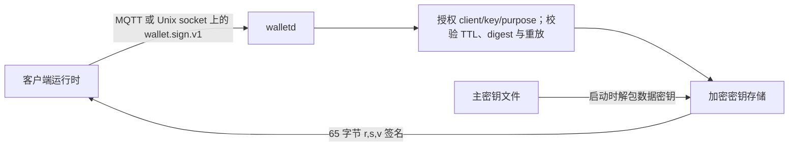

# Agent Wallet

Agent Wallet 是一个小型、进程隔离的 Rust 服务，独占 EOA 私钥并签署已经
计算好的 EIP-712 digest。Flowgent、Sigbot 等客户端负责支付编排，但永远
不加载或解密私钥。



## 边界

- `walletd` 负责 secp256k1 密钥生成/导入、EOA 地址派生、加密存储、请求
  校验和可恢复 digest 签名。
- 客户端负责业务策略、x402 payload 构造、EIP-712 hash 与 signed resource
  retry；resource server 负责 Facilitator settlement。
- 协议只携带 32 字节 digest，不携带私钥，也不嵌入 Flowgent/Sigbot
  领域模型。
- 使用 `walletd key ...` 离线管理密钥；修改密钥或轮换主密钥前应停止
  daemon。

## 存储与签名

存储首次打开时生成随机 256 位数据加密密钥。由主密钥通过 HKDF-SHA-256
派生出的密钥仅负责包装数据密钥。每个 EOA 私钥使用 XChaCha20-Poly1305
和绑定元数据的 AAD 独立加密。因此主密钥轮换只需原子替换很小的数据密钥
信封，无需批量解密、重写私钥。

Rust 所有权允许的私钥内存会在使用后清零，本 crate 禁止自身使用
`unsafe`。这些措施降低内存破坏和意外泄露风险，但不能抵御已失陷的宿主机
或消息代理。

## 构建与运行

```bash
make lock
make test
make e2e
make lint
make verify
make build
make image

cp config/wallet.example.toml config/wallet.toml
walletd master-key generate --output /run/secrets/wallet/master.key
walletd --config config/wallet.toml key generate payer
walletd --config config/wallet.toml serve
```

`make verify` 是完整验收入口；Flowgent 根 Makefile 刻意不包含任何 Wallet
target。

`make image` 暴露可覆盖的 `BUILDER_IMAGE`、`RUNTIME_IMAGE` 与
`DOCKER_BUILD_ARGS`。默认使用可达的 Alpine mirror，并在 build stage 安装发行版
Rust toolchain；Wallet release pipeline **MAY** 改用按 digest 固定的等价内部镜像。

导入命令从文件读取 32 字节 secp256k1 私钥的十六进制文本，避免将秘密暴露
在进程参数中。Secret input **MUST** 是 owner-only 普通文件且 **MUST NOT**
为 symlink：

```bash
walletd --config config/wallet.toml key import payer \
  --private-key-file /run/secrets/wallet/payer.hex
```

停止服务后执行 `master-key rotate --new-key-file PATH`，并在重启前更新
`store.master_key_file`。旧主密钥不能再打开轮换后的信封。

## 线协议

MQTT client 发布到 `wallet/v1/sign/requests/{client_id}`，Wallet 通过
`$share/{group}/wallet/v1/sign/requests/+` 消费，并在
`wallet/v1/sign/responses/{client_id}` 响应。Wallet 要求 topic suffix 与
JSON client ID 一致。本地模式在权限为 `0600` 的 Unix socket 上交换相同的
单行 JSON 协议。

请求包含 `version`、UUID `request_id`、安全的 `client_id`、`wallet_id`、
`purpose`、`scheme=eip712-secp256k1`、base64 `digest_b64`，以及受限的
`issued_at`/`expires_at` 时间窗。Client policy **MUST** 同时授权 client ID、
wallet ID 与 purpose。前缀重叠时只应用最长、最具体的匹配规则；重复前缀为
非法配置。成功响应返回 EOA 地址和十六进制 65 字节 `r || s || v` 签名，
其中 `v` 为 27 或 28。

MQTT 默认至少一次投递。`walletd` 按 request ID 缓存响应：相同请求重复
投递是幂等的；同一 ID 携带不同 digest 会被拒绝。

## 运维规则

- 主密钥文件 **MUST** 由 `walletd master-key generate` 生成，且
  **MUST** 是 owner-only 普通文件，**MUST NOT** 为 symlink。
- 生产 MQTT MUST 启用认证、ACL 和 TLS。
- Broker ACL **MUST** 将每套 credential 绑定到自己的 client request/response
  topics；进程内 policy 再独立绑定 client prefix 与 key。
- 一个进程独占一个加密 store。同一消费组中的实例需要分别 provision
  具有相同逻辑 key identity 的 store。
- 日志与指标 MUST NOT 包含私钥、主密钥、digest 或签名。
- 服务刻意不支持原始消息签名和任意交易签名。
